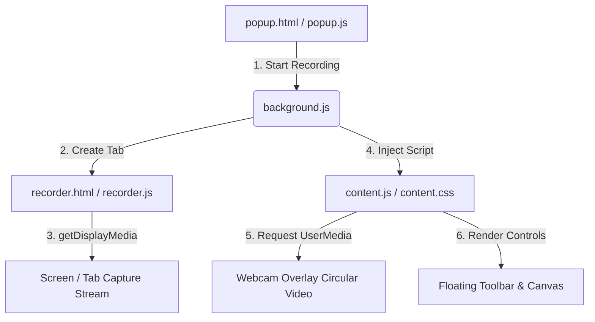

# VeloRecord Pro - Document of Reasoning

This document outlines the architectural patterns, UX decisions, and technical choices implemented for **VeloRecord Pro** (Loom-like Chrome Extension).

---

## 1. Architectural Decisions

### Manifest V3 Migration
To comply with Google Chrome store guidelines, we implemented **Manifest V3** natively. This introduced challenges regarding access to DOM APIs and streaming libraries in background workers, which we solved through a coordinated multi-context approach:

### Media Capture Strategy (The Hybrid Model)
- **Background Worker (`background.js`)**: Acts as the message broker forwarding user controls (Pause, Resume, Stop) between content script and recorder page.
- **Dedicated Capture Tab (`recorder.html`)**: Triggers native chrome prompt `getDisplayMedia` inside a full window to ensure a valid user gesture context, and runs `MediaRecorder` safely.
- **Content Script Overlay (`content.js`)**: Injects the floating control bar, stopwatch timer, and the draggable circular video webcam bubble directly on the recorded website page. Since these overlays are part of the target DOM, they are captured **automatically** by the screen stream without requiring expensive canvas compositing.

### Audio Mixing Graph
We built a custom audio routing graph using the **Web Audio API** to mix:
1. Microphone Audio (via user media)
2. Tab/System Audio (via display media)
This is mixed into a single audio track, merged with the video track, and encoded as standard WebM/Opus data.

### IndexedDB Storage Engine
Chrome extension memory is restricted. Standard Base64 strings or in-memory arrays crash if recordings exceed a few minutes. We created an asynchronous database engine using browser **IndexedDB** to store binary video blobs. This allows users to store gigabytes of recordings locally.

---

## 2. Thinking Out of the Box: High-Fidelity Client-Side Video Trimming
Most browser video editors require a backend server or heavy WebAssembly modules (like FFmpeg.wasm, which can take up to 30MB to load). 

To solve this completely client-side in seconds, we implemented a **Canvas-Recapture Trimmer**:
1. The user selects a trim range using a customized double-slider.
2. When applying the trim, we play the video file from the chosen start point to the end point.
3. An offscreen Canvas redrafts the video frames frame-by-frame at 30 FPS.
4. We record the Canvas stream and target audio stream back into a new MediaStream chunk.
5. The trimmed chunk is saved back into IndexedDB, and metadata metrics (duration, file size) are updated.

---

## 3. UI/UX Excellence
To stand out, we avoided generic styles and focused on a sleek, dark creative suite motif:
- **Typography & Theme**: Curated Outfit font with vibrant neon pink/orange gradients, glassmorphism panels, and clear active states.
- **Webcam Circle**: Draggable and mirrored to emulate a physical camera experience.
- **Annotation Canvas**: Transparent overlay. When drawing is toggled off, `pointer-events: none` is applied so the user can interact with the webpage normally during the recording.
- **AI Minutes & Chapters**: Integrates automatic timestamped chapter breakdowns and key takeaway bullet lists in the dashboard.

---

## 4. Verification & Installation
1. Unzip the `VeloRecord-Extension.zip` package.
2. Go to `chrome://extensions/` in Chrome.
3. Toggle **Developer mode** in the top-right.
4. Click **Load unpacked** and select the unzipped directory.
5. Record, draw, trim, and view your collection!
